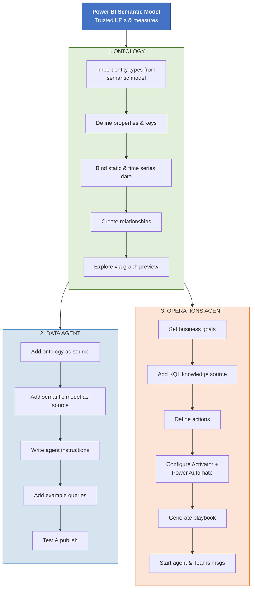

# Walkthrough Summary: End-to-End Flow

This diagram shows the full Fabric IQ stack — from your Power BI semantic model through the ontology layer to both agent types.

---

---

## Phase-by-phase summary

| Phase | Key deliverable | Dependencies |
|:------|:----------------|:-------------|
| **Phase 1** | Tenant settings enabled, workspace provisioned | Fabric admin access |
| **Phase 2** | Ontology with entity types, bindings, relationships, graph | Phase 1 complete, Power BI semantic model |
| **Phase 3** | Published data agent with instructions and tested queries | Phase 1 + 2 complete |
| **Phase 4** | Running operations agent with playbook and Teams integration | Phase 1 + eventhouse + KQL database |
